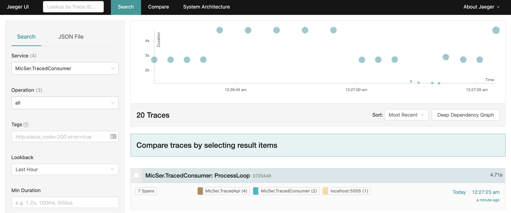

Run Traced API  
```bash
URLS=http://localhost:5005 dotnet run --project src/MicSer.TracedApi
```

Run Jaeger  
```bash
docker run -d --name jaeger \
    -e COLLECTOR_ZIPKIN_HTTP_PORT=9411 \
    -p 5775:5775/udp \
    -p 6831:6831/udp \
    -p 6832:6832/udp \
    -p 5778:5778 \
    -p 16686:16686 \
    -p 14268:14268 \
    -p 14250:14250 \
    -p 9411:9411 \
    jaegertracing/all-in-one:1.21
```

Visit http://localhost:16686/ for Jaeger UI

  
### Sample output  

Trace list  


Trace Detail
